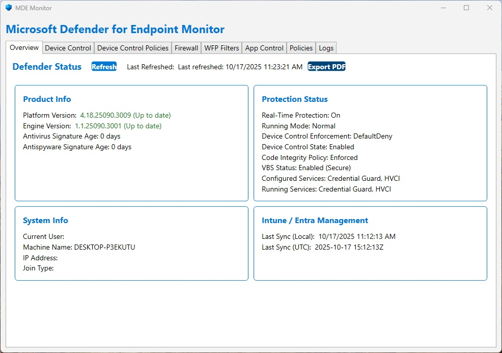
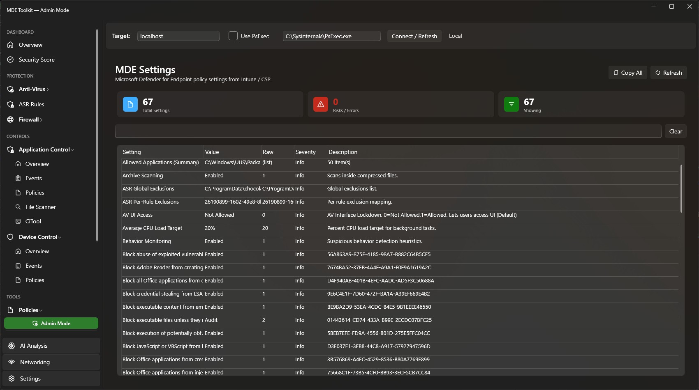
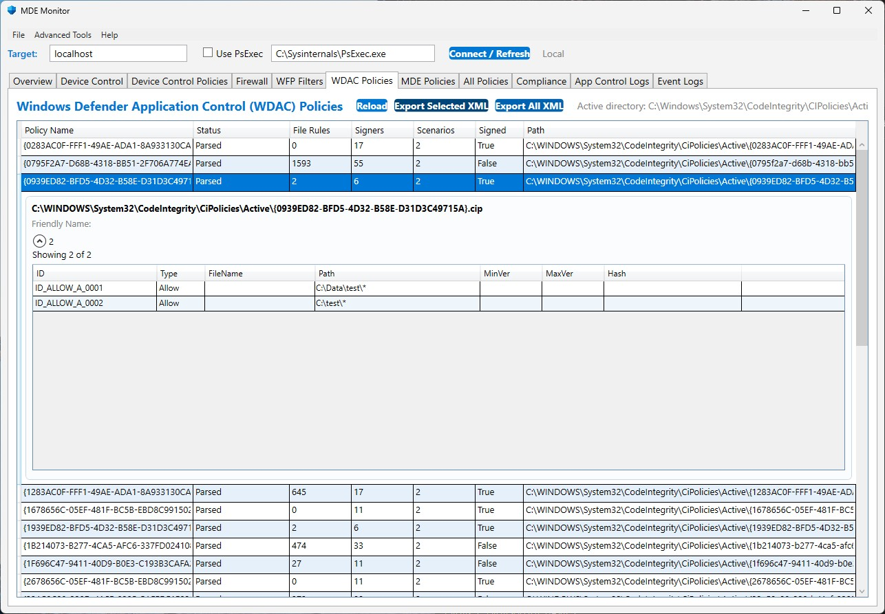
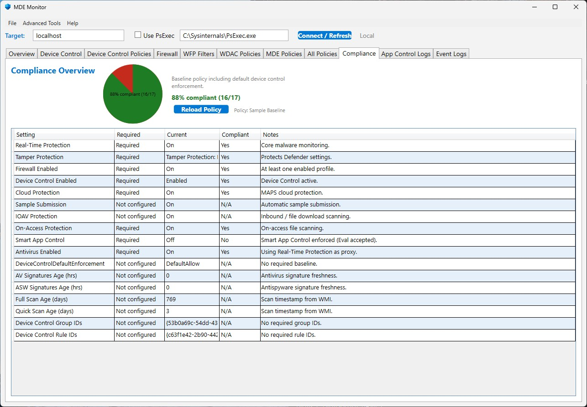

# MDE Toolkit

> **Microsoft makes no guarantees** — no warranties, support, maintenance, performance assurances, or commitments regarding security, compliance, or fitness for a particular purpose.

🌐 **Website:** [https://mdetoolkit.org/](https://aka.ms/mdetool)

Free, open-source desktop tool for monitoring and managing Microsoft Defender for Endpoint security posture. Built with WPF / .NET 8.



## ✨ Features

### Security Monitoring
- **Security Score** — Comprehensive posture assessment with category breakdowns and remediation guidance
- **Defender Status** — Versions, real-time protection, signature ages, tamper protection, cloud states
- **MDE Onboarding** — Sense service status, onboarding verification
- **Firewall** — Profile status (Domain/Private/Public), recent DROP packets with text filter

### Policy & Configuration
- **Defender Policies** — Interpreted registry settings, ASR rule expansion, exclusion summaries
- **WDAC / App Control** — Auto-discovery (local & remote), summary counts, per-policy XML export, lazy/paged FileRules
- **Device Control** — USB / storage allow & deny events, policy viewer
- **ASR Rules** — Full rule enumeration with block/audit/warn mode breakdown

### Enterprise
- **Background Collection** — Silent scheduled task collection (SYSTEM) + upload (interactive user)
- **Function App Ingestion** — Azure Table Storage, Blob, Sentinel, or Dataverse backends
- **Registry-Driven Config** — All settings via `HKLM\SOFTWARE\Policies\MDE-Toolkit`
- **Power BI Ready** — Flat table columns with ready-to-use Power Query and DAX measures

### Analysis & Export
- **AI Analysis** — Optional AI-powered security posture analysis
- **PDF Report** — Full snapshot export (includes WDAC XML, compliance, filters)
- **JSON Export** — Machine-readable health report for automation
- **Compliance Snapshot** — JSON-driven policy baseline → pass/fail %

### Advanced
- **Remote Mode** — Target remote machines via UNC / WinRM / optional PsExec fallback
- **WFP Summary** — Filter counts + top rule names
- **Advanced Networking** — Deep network diagnostics
- **VBS / HVCI / Credential Guard** — Virtualization-based security status

## 🚀 Quick Start

**Download** the latest installer or ZIP from [GitHub Releases](https://github.com/chlaplan/MDE-Monitoring-App/releases).

```
# Or use the short link
https://aka.ms/mdetool
```

### System Requirements
- Windows 10 version 1809+ or Windows 11
- .NET 8 Desktop Runtime
- Administrator privileges recommended for full functionality
- CiTool.exe requires Windows 11 22H2+ or Windows Server 2025+

## 🏢 Enterprise Deployment

MDE Toolkit supports fleet-wide deployment with centralized telemetry collection:

1. **Azure Setup** — Create Storage Account, Function App, Entra ID app registration
2. **MSI Deployment** — Silent install via SCCM, Intune, or GPO
3. **Registry Config** — Enterprise settings at `HKLM\SOFTWARE\Policies\MDE-Toolkit`
4. **Scheduled Tasks** — Collect (SYSTEM) + Upload (interactive user) every 8 hours
5. **Power BI** — Connect to Table Storage for fleet dashboards

📖 Full guide: [Enterprise Setup](https://chlaplan.github.io/MDE-Monitoring-App/enterprise-setup.html)

## 📸 Screenshots






## 🛠️ Build from Source

```bash
# Clone
git clone https://github.com/chlaplan/MDE-Monitoring-App.git
cd MDE-Monitoring-App

# Build (requires .NET 8 SDK)
dotnet build -c Release
```

## Configuration Files
- `Data/DefenderPolicyDefinitions.json` — Policy interpretation definitions
- `CompliancePolicy.config.json` — Compliance baseline rules

## Troubleshooting

| Symptom | Hint |
|---------|------|
| Empty WDAC list | No `*.cip` in `CodeIntegrity\CiPolicies\Active` or access denied |
| Missing ASR rules | `ASRRules` registry value not deployed |
| High WFP count warning | >10K filters (investigate layering) |
| PDF missing sections | Load data first (Refresh) |
| Upload fails | Ensure device is Entra ID / Hybrid joined with PRT |

## License

Released under the [MIT License](LICENSE).

This project is not affiliated with or endorsed by Microsoft.
